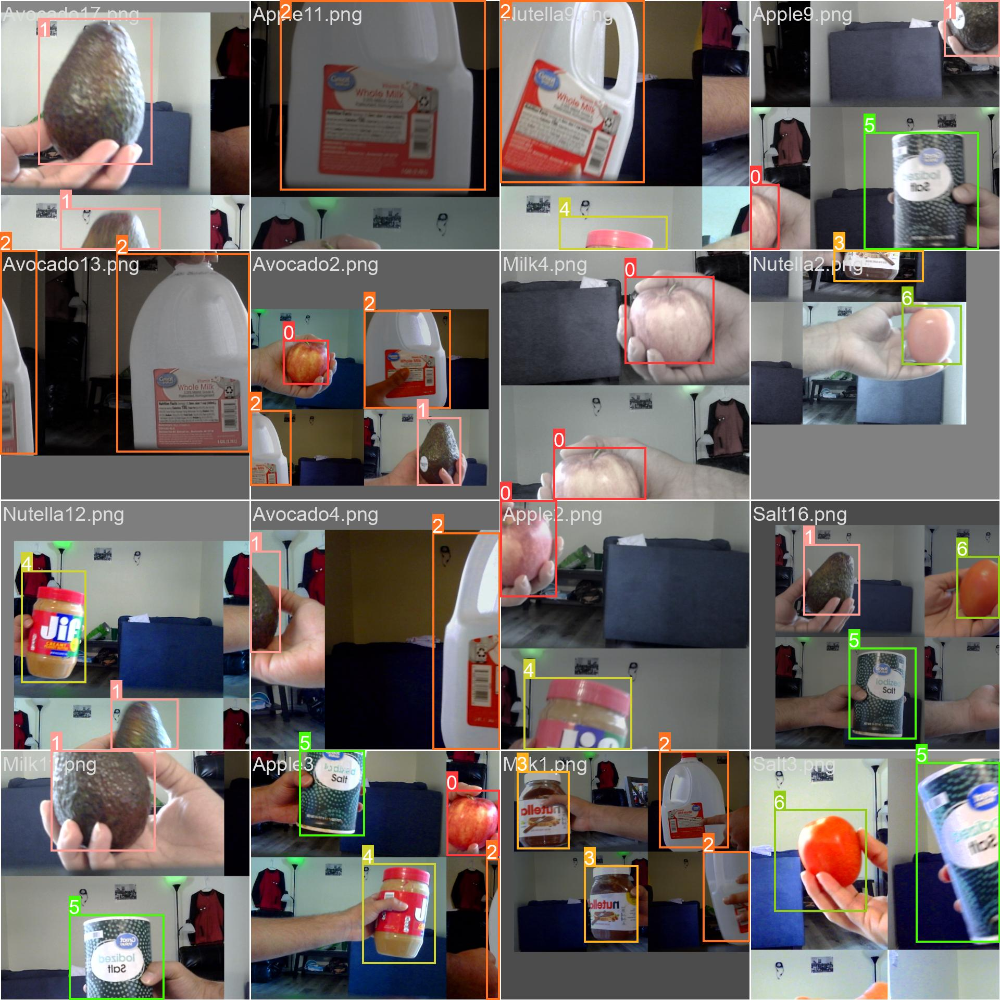

<h1>Programming for Internet of Things</h1>
<ul>
  <h3>Team Members</h3>
  <li>Alyana Nelson</li>
  <li>Ramprakash Sridharan</li>
</ul>
<ul>
   <h3>Contents</h3>
<li>Node server, HTML page, JS - under node_server/  -->  "node_server.js, update_items.js, index.html"</li>
  <b>Note</b> : The index_combined.html and node_server_combined.js are files used to host the page on AWS. The HTML contains all the javascipt inline to the HTML.
<li>Python code - under node_server/   -->  "model_deploy.py"  </li>
<li>Dataset - under dataset/ </li>
<li>Mpdel training weights and metrics - under exp2/   -->  "weights/best.pt"</li>  
</ul>

 
<h3>Description</h3>

A kitchen-based system that allows you to effortlessly add items to your grocery list. 
Simply show the food product to the camera, and it will automatically update your 'grocery cart'.  such as an Apples, water, yogurt,  cereal, oil, etc.

  
<h3>Model training</h3>

Training images - batch0

  

Training images - batch1

  
<h3>Training Results</h3>
 

Confusion Matrix

  
<h3>Final Results</h3>

Server hosted on AWS

  

Webpage hosted on AWS

  
